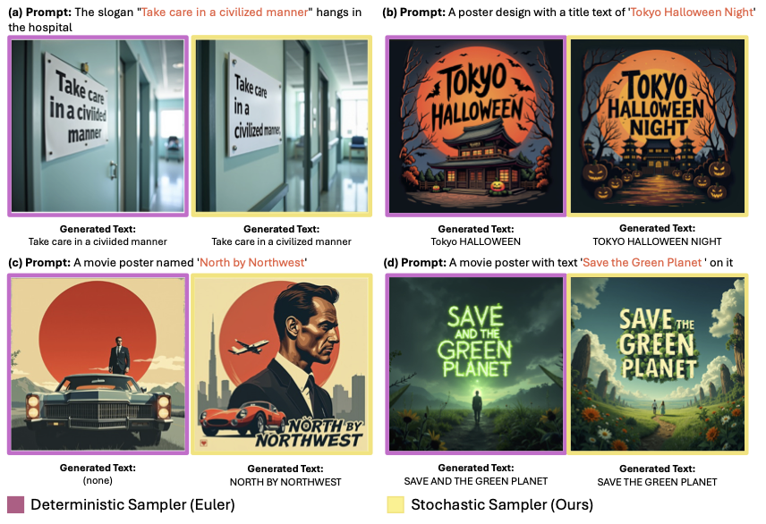

# AMO Sampler: Enhancing Text Rendering with Overshooting (CVPR 2025)

[](https://www.python.org/)[](https://opensource.org/licenses/Apache-2.0) [](https://arxiv.org/abs/2411.19415)

This repository provides the official implementation for the **Overshooting Sampler** and **AMO Sampler** introduced in the CVPR 2025 paper: **AMO Sampler: Enhancing Text Rendering with Overshooting**.

[**Paper Link: https://arxiv.org/abs/2411.19415**](https://arxiv.org/abs/2411.19415)

## Overview

State-of-the-art text-to-image models like Stable Diffusion 3 (SD3), Flux, and AuraFlow often struggle to accurately render written text within generated images, resulting in misspelled or inconsistent text. This work introduces **AMO (Attention Modulated Overshooting) Sampler**, a training-free method with minimal computational overhead that significantly enhances text rendering quality in pre-trained rectified flow models.

We propose **Overshooting Sampler** and **AMO Sampler** that alternates between over-simulating the learned ODE and reintroducing noise (Langevin dynamics) to correct compounding errors from standard Euler steps. 

**Key Features:**

* Implementation of the **Overshooting Sampler** and **AMO Sampler**.
* Training-free method, compatible with pre-trained Rectified Flow models (e.g., SD3, Flux).
* Demonstrated **32.3% (SD3)** and **35.9% (Flux)** improvement in text rendering accuracy.
* Minimal computational overhead compared to standard Euler samplers.


 

## Installation

**Steps:**

1.  **Clone the repository recursively** to include the modified `diffusers` submodule:
    ```bash
    git clone --recursive git@github.com:hxixixh/amo-release.git
    ```
    *(If you cloned non-recursively, run `git submodule update --init --recursive` inside the directory)*

2.  **Create and activate a virtual environment:**
      ```bash
      conda create -n amo python=3.12
      conda activate amo
      ```
3.  **Install PyTorch matching your system:**
    Visit the [PyTorch website](https://pytorch.org/get-started/locally/) for the correct command based on your OS and CUDA version.

4.  **Install the modified `diffusers` submodule and other dependencies:**
    ```bash
    # Install the modified diffusers library from the submodule
    pip install -e ./diffusion-amo 

    # Install other requirements
    pip install -r requirements.txt
    ```

## Usage

### Downloading Models

This code requires pre-trained Rectified Flow models like [Stable Diffusion 3 Medium](https://huggingface.co/stabilityai/stable-diffusion-3-medium-diffusers) or [FLUX.1-schnell](https://huggingface.co/black-forest-labs/FLUX.1-schnell). Our scripts assume models are downloaded from the Hugging Face Hub. Authentication might be required (`huggingface-cli login`). Models will typically be downloaded and cached automatically by the `diffusers` library upon first use.

### Running Inference

Use the `run.py` script to generate images. Key arguments:

* `--scheduler`: Choose the sampler (`euler`, `overshoot`).
* `--num_inference_steps`: Number of steps (e.g., 20).
* `--model_type`: Base model (`flux` or `sd3`).
* `--use_att`: Enable Attention Modulation for the AMO sampler (Use `True` for AMO, omit or `False` for standard Overshooting).
* `--prompt`: Text prompt to generate (Alternatively, modify `run.py` to read from `prompts.txt`).
* `--overshooting_strength` (`-c`): The 'c' parameter for Overshooting/AMO samplers (default: 2.0). See paper for details.

**Examples:**

1.  **Euler Sampler (Baseline):**
    ```bash
    python run.py --scheduler="euler" --num_inference_steps=20 --model_type="flux"
    ```

2.  **Overshooting Sampler:**
    ```bash
    python run.py --scheduler="overshoot" --num_inference_steps=20 --model_type="flux" --overshooting_strength=2.0
    ```

3.  **AMO Sampler:**
    ```bash
    python run.py --scheduler="overshoot" --use_att=True --num_inference_steps=20 --model_type="flux" --overshooting_strength=2.0
    ```

The file `prompts.txt` contains 100 diverse prompts used for human evaluation in the paper.

## Implementation Details

This implementation utilizes a modified version of the `diffusers` library (v0.30.1), included as the `diffusion-amo` submodule.

**Key Modifications:**

* **New Scheduler:** `diffusion-amo/src/diffusers/schedulers/scheduling_stochastic_rf_discrete_overshot.py` implements the core Overshooting sampling logic, extending the standard Diffusers scheduler framework.
* **Modified Pipeline:** `diffusers-amo/src/diffusers/pipelines/flux/pipeline_flux.py` and `diffusers-amo/src/diffusers/pipelines/stable_diffusion_3/pipeline_stable_diffusion_3.py` implements the core AMO sampling logic with attention modulation, extending the standard Diffusers pipeline framework.

The samplers introduce parameters like overshooting strength (`c`), which can be configured during scheduler initialization (see `run.py`).

## License

This project is licensed under the Apache 2.0 License. See the [LICENSE](LICENSE) file for details. The `diffusion-amo` submodule retains its original Apache 2.0 license from the `diffusers` library.

## Citation

If you find this work useful for your research, please cite our paper:

```bibtex
@article{hu2024amo,
  title={AMO Sampler: Enhancing Text Rendering with Overshooting},
  author={Hu, Xixi and Xu, Keyang and Liu, Bo and Liu, Qiang and Fei, Hongliang},
  journal={arXiv preprint arXiv:2411.19415},
  year={2024}
}
```

## Contributing / Issues

Please feel free to open an issue on GitHub if you encounter problems or have suggestions.
